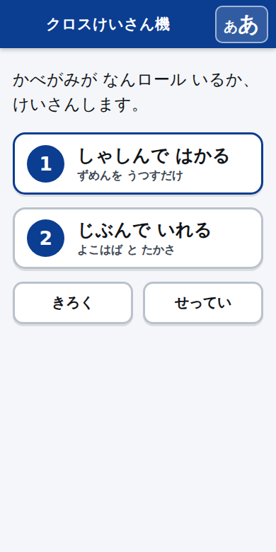
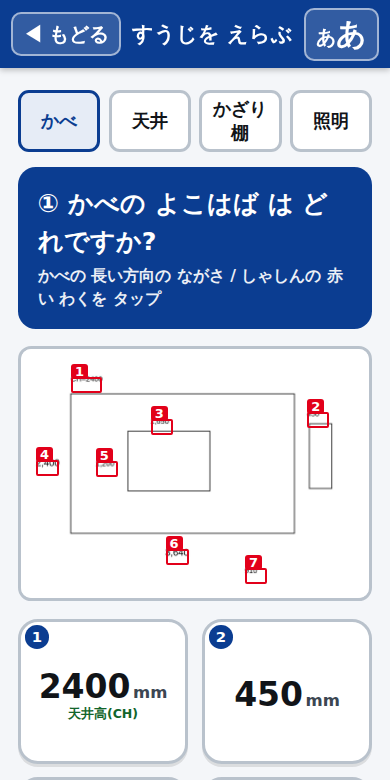
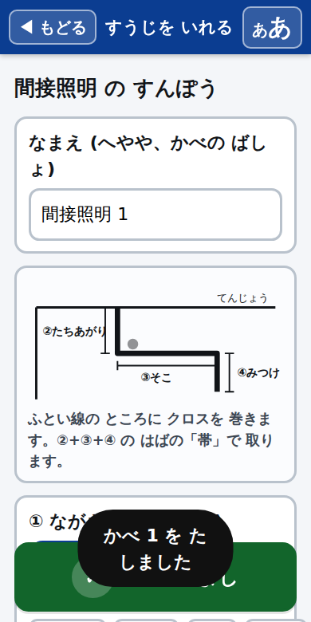
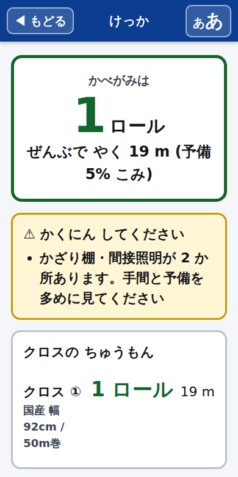

# クロスけいさん機

内装の図面から、**壁紙(クロス)が何ロール必要か**を出す道具です。
スマホで図面の写真を撮ると、図面に書いてある寸法を読み取って、ロール数と発注メモまで出します。

- **ぜんぶスマホの中だけで動きます。** 通信なし、APIキーなし、お金もかかりません
- 文字が大きく、ボタンが大きく、画面はいつも1つだけ。**老眼でも、手袋でも使えます**
- 結果は**声でも読み上げ**ます
- 職人が面倒だと言う **飾り棚(ニッチ)** と **間接照明(コーブ)** を、展開して取り都合まで計算します

| ホーム | 写真から数字をえらぶ | 間接照明の入力 | 結果 |
|---|---|---|---|
|  |  |  |  |

---

## つかいかた(現場の人向け)

1. ブラウザでアプリを開く(下の「動かしかた」で出てくるアドレス)
2. スマホなら **ホーム画面に追加** しておく。アプリのように開けます
3. 画面のとおりに進む

| ボタン | すること |
|---|---|
| **しゃしんで はかる** | 図面を撮る → 数字を読む → 出てきた数字を**タップして えらぶ** |
| **じぶんで いれる** | 横幅と高さを、大きなボタンで入れる |
| **けいさん する** | ロール数が大きく出る。読み上げ・コピー・印刷ができる |

### 写真から読むところ

写真を撮って「すうじを よみとる」を押すと、図面の中の寸法が **①②③…** と番号つきで出ます。
あとは聞かれるまま、**数字をタップするだけ**です。

```
① かべの よこはば は どれですか?   → 3640 をタップ
② かべの たかさ は どれですか?     → 2400 をタップ  (「よくある たかさ 2400 / 2500」も出ます)
                                     → かべが1つ増える。次のかべも同じように選べる
```

- 上の「かべ / 天井 / かざり棚 / 照明」を切り替えると、聞かれることが変わります
- `CH=2400` のような書き方は **天井高** として印がつきます
- `3,640` `2.4m` `910mm` `45cm` は、どれも mm に直して扱います
- 読めなかったときは「この なかに ない → じぶんで いれる」で、手入力に逃げられます

**読み取りは万能ではありません。** 印刷された寸法線の数字はよく読めますが、
手書き・かすれ・斜めからの撮影は苦手です。**数字は必ず職人の目で確かめてください。**
うまく読めないときは、図面に近づいて、まっすぐ、明るいところで撮り直すとよく読めます。

---

## 動かしかた

```bash
npm install     # 開発用(OCR の一式を取り込むときだけ必要)
npm start       # → http://localhost:8787
```

同じ Wi-Fi のスマホから使うときは、パソコンの IP を見て
`http://192.168.x.x:8787` を開いてください。

### サーバーはほぼ飾りです

`public/` の中身がアプリの全部です。**GitHub Pages のような静的な置き場に上げるだけで動きます。**
月額ゼロ、サーバー管理なし。同梱のサーバーは `public/` を配るだけのもので、
外部ライブラリを一切使っていません(ブラウザの Worker と WebAssembly は
`file://` だと読めないので、ローカルで試すときだけ必要)。

| 環境変数 | 既定 | なに |
|---|---|---|
| `PORT` | 8787 | 待ち受けるポート |

---

## 中身

```
public/               スマホで開く画面(これだけで動く)
  engine.js           ← 計算はぜんぶここ。DOM を触らない純粋な関数だけ
  ocr.js              写真から数字を読む(Tesseract.js を呼ぶところ)
  ocr-parse.js        読めた文字から寸法を拾う。ここも純粋な関数だけ
  app.js              画面の組み立て
  style.css           大きい文字・大きいボタン・印刷用の体裁
  sw.js               オフライン用
  vendor/tesseract/   OCR の一式(約 10MB)。CDN に頼らず同梱している
server/index.mjs      public/ を配るだけ。依存ライブラリなし
scripts/vendor.mjs    OCR の一式を node_modules から public/vendor/ に取り込む
test/                 node --test で動く
docs/keisan.md        計算のしかた(職人さん向け・全部の根拠)
```

```bash
npm test          # 30 件
npm run vendor    # OCR の一式を入れ直す(バージョンを上げたとき)
```

### なぜ OCR を同梱しているか

現場は電波が悪いからです。CDN から落とす作りだと、圏外でシャッターを切った瞬間に使えなくなります。
同梱してあれば、一度開いたあとは機内モードでも読み取れます(Service Worker がキャッシュします)。
読み取りに使うのは英語の学習データだけです。**数字しか読まないので、これで足ります**
(日本語データは3倍以上重く、部屋名は手で直せばよいため)。

---

## 数字の根拠

既定値は「国産クロス 幅92cm / 50m巻、重ねしろ 20mm、上下の切りしろ 100mm、予備 5%」です。
どうやってロール数まで持っていくかは **[docs/keisan.md](docs/keisan.md)** に全部書いてあります。
現場のやり方に合わせて、**せってい**画面から変えられます。

のり・ジョイントコークの量は目安です。メーカーと現場で変わります。

---

## 気をつけること

- 読み取った数字は、必ず現場の目で確かめてください。このアプリは読めなかったところを
  黙って埋めません(0 のままにして警告を出します)。
- ロール数は予備を乗せた切り上げです。柄物・斜め張り・大きな柄合わせは、別に見てください。
